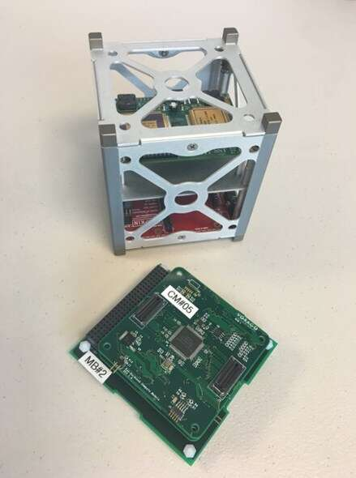

# __The CubeSat__

The field of small satellites is growing rapidly, over 1000 CubeSats have been launched as of January 2019. Compared to conventional satellites, CubeSats are inexpensive to develop and launch, and can be networked together to form constellations. A 1U CubeSat has a form factor of 10 x 10 x 11.35cm. The CubeSat chassis is shown below along with a standard form factor circuit board that fits into the chassis. These can be concatenated with additional 1U cubes to form larger systems such as 3U or 6U depending on the complexity of the satellite system requirements. CubeSats are reliant upon embedded control systems.
 

  

# __How the Embedded System Works__ 

# __Design Challenges__

## __Throughput__

CubeSats are often equipped with sensors which generate large volumes of data. For example, gyroscopes, star sensors, magnetometers, and CCD cameras. A common application of CubeSats is for imaging of the Earth's surface. Limited bandwidth may be available for transmission of images from CubeSats to the ground. Hence, it may be necessary to perform image processing with the onboard microprocessor in order to reduce the data sufficiently for transmission. In any case, there will be times where the on-board processor must handle significant throughput.

## __Response__ 

CubeSats must be capable of responding to information received from various sensors and acting on it quickly. For example, the satellite  may enter an uncontrolled spin and need to compute the necessary corrective action based on the gyroscope data to correct the spin as quickly as possible. It must also be able to respond immediately to commands received from the ground. For example, it may need to perform a collision avoidance maneuver if orbital debris or another satellite are going to intersect it's orbit. 

## __Testability__

Testing the satellite fully under space-like conditions on the ground is challenging. There are many situations that may occur in space which are not possible to recreate in the labarotory. 

One aspect of the satellite that must be thoroughly tested is the CubeSat's de-tumbling control system and hardware. If the satellite enters an uncontrolled rotation (tumble) it must be able to quickly correct it's orientation and regain a controlled orientation. To recreate the conditions of space in which this scenario arises, it is necessary to use a Helmholtz coil to recreate the magnetic environment of space and a spherical air bearing which simulates the friction free environment in orbit. These two components allow for the creation of an adjustable system that simulates the satellite in orbit. 

An example of a CubeSat air bearing setup is shown in the following video from Clyde Space:

## __Debugability__
_Without a screen or keyboard, finding out what software is doing wrong is troublesome._

## __Reliability__
Once it is launched, there is no option to physically interact with the system to address potential problems. If there is a malfunction, the system must be able to recover on its own or through remote intervention from the ground.

In addition to the isolated operation of the satellite, the satellite must also operate in high radiation conditions which are challenging to operate electronics in. For space applications, radiation can damage electronics in two ways. Total ionizing dose (TID) is the amount of cumulative radiation received. Single event effects are the disturbances created by single particles hitting the electronics. Total dose can affect transistor performance. Single event upsets (SEUs) can affect the logic state of memory. An SEU is a change of state caused by one single ionizing particle (ions, electrons, photons...) striking a sensitive node in a micro-electronic device (such as in a microprocessor, semiconductor memory, or power transistors). The state change is a result of the free charge created by ionization in (or close to) an important node of a logic element (e.g. a memory bit). The error in device output or operation caused as a result of the strike is called an SEU or a soft error. A single event latchup (SEL) can affect the output transistors on CMOS logic, potentially causing a high-current state.

 If the processor jumps to an erroneous memory location through a SEU or a software exception, the watchdog timer resets the processor to restore operations.

## __Memory Space__

The range of on-board memory for small spacecraft is wide, typically starting around 32 kB and increasing with available technology. The main requirement of memory for application in satellite systems is high reliability. 

Single-event upsets can interrupt discrete logic, including processing. Triple modular redundancy (TMR) is a fault mitigation technique where logic is replicated three times, and the output of the logic is determined by a majority-vote. 

Multiple copies of the firmware are also stored to mitigate against corruption of the data. Like data memory, program memory is also susceptible to single-event upsets and device failure. To counter this issue, a bootloader may be used to check the validity of the firmware and provide a mechanism for uploading new versions. Additionally, multiple copies of the firmware may be stored in memory in case the primary version is corrupt.

## __Program Installation and Upgrade__
Usually have a ground mock of the system to thoroughly test any software updates before upload to the satellite.

## __Power Consumption__
The small size of CubeSats is their main advantage along with their low production cost due to the ability to manufacture at scale. However, the limited size has an impact on the available power resources. In space, solar power is widely used to power satellites. The limited real estate available to deploy solar panels on CubeSats results in limited power resources. Also, the limited size restricts the available space for power storage solutions. CubeSats must be equipped with storage and low power modes when to allow for operation when the satellite is passing through the Earth's shadow. 

Since many components are more prone to radiation effects when powered on, a candidate mitigation strategy is to power off devices when they are not operationally needed.

## __Security__
Be able to prevent malicious uploads...especially for military satellites. Maintain secure communications. 

## __Cost__
CubeSats main selling point is their low cost compared to more traditional satellites. The cost per lb to lauch mass into a low earth orbit is still very high despite recent progress in this area by SpaceX and others. Hence, minimizing the mass of the satellite is critical. 

One application of CubeSat constellations is to provide broadband internet from space. SpaceX's Starlink constellation is aiming to eventually fly 12,000 satellites. Minimizing the cost of the hardware components is critical to the success of implementing this kind of infrastructure which is currently projected to cost \$10B.

# __References__

https://en.wikipedia.org/wiki/CubeSat

https://www.embedded.com/the-challenges-and-evolution-of-CubeSat-electronics/

https://sst-soa.arc.nasa.gov

https://en.wikipedia.org/wiki/Single-event_upset

